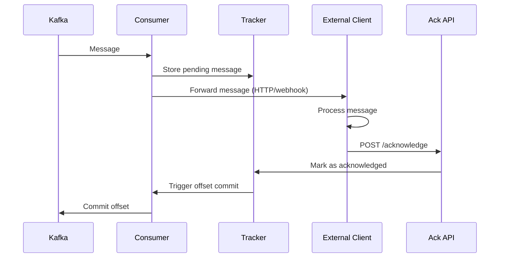
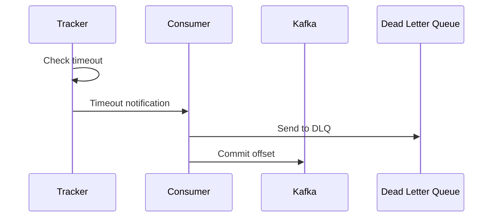

# External Client Acknowledgment System

## Overview

The External Client Acknowledgment System provides a mechanism for external clients to acknowledge message processing completion back to the Kafka abstraction layer. This enables reliable message processing patterns where the Kafka consumer waits for explicit confirmation from downstream systems before committing offsets.

## Architecture

### Core Components

```
external-acknowledgment/
├── api/
│   ├── AcknowledgmentController.java
│   ├── dto/
│   │   ├── AcknowledgmentRequest.java
│   │   ├── AcknowledgmentResponse.java
│   │   └── PendingMessageResponse.java
│   └── exception/
│       ├── MessageNotFoundException.java
│       └── AcknowledgmentException.java
├── service/
│   ├── ExternalAcknowledgmentService.java
│   ├── PendingMessageTracker.java
│   └── AcknowledgmentTimeoutHandler.java
├── storage/
│   ├── PendingMessageRepository.java
│   ├── entity/
│   │   └── PendingMessage.java
│   └── cache/
│       └── PendingMessageCache.java
└── config/
    └── ExternalAcknowledgmentConfig.java
```

## Message Flow

### 1. Message Processing Flow



### 2. Timeout Handling Flow



## Implementation Details

### 1. Pending Message Entity

```java
@Entity
@Table(name = "pending_messages")
@Data
@NoArgsConstructor
@AllArgsConstructor
public class PendingMessage {
    
    @Id
    private String messageId;
    
    @Column(nullable = false)
    private String topic;
    
    @Column(nullable = false)
    private Integer partition;
    
    @Column(nullable = false)
    private Long offset;
    
    @Column(nullable = false)
    private String consumerGroupId;
    
    @Column(nullable = false)
    private String messageKey;
    
    @Lob
    private String messageValue;
    
    @Column(nullable = false)
    private Instant receivedAt;
    
    @Column(nullable = false)
    private Instant expiresAt;
    
    @Enumerated(EnumType.STRING)
    private MessageStatus status;
    
    private String clientId;
    private String correlationId;
    private Integer retryCount;
    private String lastError;
    
    public enum MessageStatus {
        PENDING,
        ACKNOWLEDGED,
        TIMEOUT,
        FAILED
    }
}
```

### 2. Acknowledgment DTOs

```java
@Data
@Builder
@JsonInclude(JsonInclude.Include.NON_NULL)
public class AcknowledgmentRequest {
    
    @NotBlank(message = "Message ID is required")
    private String messageId;
    
    @NotBlank(message = "Client ID is required")
    private String clientId;
    
    private String correlationId;
    
    @Valid
    private ProcessingResult result;
    
    private Map<String, Object> metadata;
    
    @Data
    @Builder
    public static class ProcessingResult {
        
        @NotNull
        private ProcessingStatus status;
        
        private String errorMessage;
        private String errorCode;
        private boolean retryable;
        
        public enum ProcessingStatus {
            SUCCESS,
            FAILED,
            PARTIAL_SUCCESS
        }
    }
}

@Data
@Builder
public class AcknowledgmentResponse {
    
    private String messageId;
    private AckStatus status;
    private String message;
    private Instant acknowledgedAt;
    
    public enum AckStatus {
        ACCEPTED,
        REJECTED,
        ALREADY_ACKNOWLEDGED,
        NOT_FOUND,
        EXPIRED
    }
}
```

### 3. External Acknowledgment Service

```java
@Service
@Slf4j
public class ExternalAcknowledgmentService {
    
    private final PendingMessageRepository repository;
    private final PendingMessageCache cache;
    private final KafkaConsumerRegistry consumerRegistry;
    private final ApplicationEventPublisher eventPublisher;
    
    @Transactional
    public AcknowledgmentResponse acknowledgeMessage(AcknowledgmentRequest request) {
        
        String messageId = request.getMessageId();
        log.debug("Processing acknowledgment for message: {}", messageId);
        
        // Try cache first, then database
        PendingMessage pendingMessage = cache.get(messageId)
            .orElseGet(() -> repository.findById(messageId).orElse(null));
            
        if (pendingMessage == null) {
            return AcknowledgmentResponse.builder()
                .messageId(messageId)
                .status(AckStatus.NOT_FOUND)
                .message("Message not found or already processed")
                .build();
        }
        
        // Validate message state
        ValidationResult validation = validateAcknowledgment(pendingMessage, request);
        if (!validation.isValid()) {
            return AcknowledgmentResponse.builder()
                .messageId(messageId)
                .status(validation.getStatus())
                .message(validation.getMessage())
                .build();
        }
        
        // Process acknowledgment
        ProcessingResult result = request.getResult();
        if (result.getStatus() == ProcessingStatus.SUCCESS) {
            return handleSuccessfulAcknowledgment(pendingMessage, request);
        } else {
            return handleFailedAcknowledgment(pendingMessage, request);
        }
    }
    
    private AcknowledgmentResponse handleSuccessfulAcknowledgment(
            PendingMessage pendingMessage, 
            AcknowledgmentRequest request) {
        
        // Update message status
        pendingMessage.setStatus(MessageStatus.ACKNOWLEDGED);
        repository.save(pendingMessage);
        cache.remove(pendingMessage.getMessageId());
        
        // Trigger offset commit
        MessageAcknowledgedEvent event = MessageAcknowledgedEvent.builder()
            .messageId(pendingMessage.getMessageId())
            .topic(pendingMessage.getTopic())
            .partition(pendingMessage.getPartition())
            .offset(pendingMessage.getOffset())
            .consumerGroupId(pendingMessage.getConsumerGroupId())
            .acknowledgedAt(Instant.now())
            .build();
            
        eventPublisher.publishEvent(event);
        
        return AcknowledgmentResponse.builder()
            .messageId(pendingMessage.getMessageId())
            .status(AckStatus.ACCEPTED)
            .message("Message acknowledged successfully")
            .acknowledgedAt(Instant.now())
            .build();
    }
    
    private AcknowledgmentResponse handleFailedAcknowledgment(
            PendingMessage pendingMessage, 
            AcknowledgmentRequest request) {
        
        ProcessingResult result = request.getResult();
        
        if (result.isRetryable() && pendingMessage.getRetryCount() < maxRetries) {
            // Schedule retry
            return scheduleRetry(pendingMessage, request);
        } else {
            // Send to DLQ
            return sendToDeadLetterQueue(pendingMessage, request);
        }
    }
    
    @EventListener
    public void handleTimeoutCheck(MessageTimeoutCheckEvent event) {
        List<PendingMessage> expiredMessages = repository.findExpiredMessages(Instant.now());
        
        for (PendingMessage message : expiredMessages) {
            handleMessageTimeout(message);
        }
    }
    
    private void handleMessageTimeout(PendingMessage message) {
        log.warn("Message timeout detected: {}", message.getMessageId());
        
        message.setStatus(MessageStatus.TIMEOUT);
        repository.save(message);
        cache.remove(message.getMessageId());
        
        // Send to DLQ or retry based on configuration
        MessageTimeoutEvent event = MessageTimeoutEvent.builder()
            .messageId(message.getMessageId())
            .topic(message.getTopic())
            .partition(message.getPartition())
            .offset(message.getOffset())
            .consumerGroupId(message.getConsumerGroupId())
            .timeoutAt(Instant.now())
            .build();
            
        eventPublisher.publishEvent(event);
    }
}
```

### 4. REST API Controller

```java
@RestController
@RequestMapping("/api/v1/acknowledgment")
@Slf4j
@Validated
public class AcknowledgmentController {
    
    private final ExternalAcknowledgmentService acknowledgmentService;
    private final PendingMessageTracker messageTracker;
    
    @PostMapping("/acknowledge")
    public ResponseEntity<AcknowledgmentResponse> acknowledgeMessage(
            @Valid @RequestBody AcknowledgmentRequest request) {
        
        log.info("Received acknowledgment request for message: {}", request.getMessageId());
        
        try {
            AcknowledgmentResponse response = acknowledgmentService.acknowledgeMessage(request);
            
            HttpStatus status = switch (response.getStatus()) {
                case ACCEPTED -> HttpStatus.OK;
                case NOT_FOUND -> HttpStatus.NOT_FOUND;
                case EXPIRED -> HttpStatus.GONE;
                case ALREADY_ACKNOWLEDGED -> HttpStatus.CONFLICT;
                case REJECTED -> HttpStatus.BAD_REQUEST;
            };
            
            return ResponseEntity.status(status).body(response);
            
        } catch (Exception e) {
            log.error("Error processing acknowledgment for message: {}", request.getMessageId(), e);
            
            AcknowledgmentResponse errorResponse = AcknowledgmentResponse.builder()
                .messageId(request.getMessageId())
                .status(AckStatus.REJECTED)
                .message("Internal server error: " + e.getMessage())
                .build();
                
            return ResponseEntity.status(HttpStatus.INTERNAL_SERVER_ERROR).body(errorResponse);
        }
    }
    
    @GetMapping("/pending")
    public ResponseEntity<List<PendingMessageResponse>> getPendingMessages(
            @RequestParam(required = false) String clientId,
            @RequestParam(required = false) String topic,
            @RequestParam(defaultValue = "0") int page,
            @RequestParam(defaultValue = "20") int size) {
        
        Pageable pageable = PageRequest.of(page, size);
        List<PendingMessageResponse> pending = messageTracker.getPendingMessages(
            clientId, topic, pageable);
            
        return ResponseEntity.ok(pending);
    }
    
    @GetMapping("/status/{messageId}")
    public ResponseEntity<MessageStatusResponse> getMessageStatus(
            @PathVariable String messageId) {
        
        Optional<MessageStatusResponse> status = messageTracker.getMessageStatus(messageId);
        
        return status.map(ResponseEntity::ok)
            .orElse(ResponseEntity.notFound().build());
    }
    
    @DeleteMapping("/cancel/{messageId}")
    public ResponseEntity<Void> cancelMessage(
            @PathVariable String messageId,
            @RequestParam String clientId) {
        
        boolean cancelled = messageTracker.cancelMessage(messageId, clientId);
        
        return cancelled ? ResponseEntity.ok().build() : ResponseEntity.notFound().build();
    }
}
```

### 5. Consumer Integration

```java
@Component
public class ExternalAckConsumerTemplate<K, V> extends KafkaConsumerTemplate<K, V> {
    
    private final ExternalAcknowledgmentService ackService;
    private final WebhookService webhookService;
    private final PendingMessageTracker messageTracker;
    
    @Override
    protected void processMessage(MessageContext<K, V> context) {
        
        // Generate unique message ID
        String messageId = generateMessageId(context);
        
        // Store as pending
        PendingMessage pendingMessage = PendingMessage.builder()
            .messageId(messageId)
            .topic(context.getTopic())
            .partition(context.getPartition())
            .offset(context.getOffset())
            .consumerGroupId(context.getGroupId())
            .messageKey(String.valueOf(context.getKey()))
            .messageValue(serializeValue(context.getValue()))
            .receivedAt(Instant.now())
            .expiresAt(Instant.now().plus(getAckTimeout()))
            .status(MessageStatus.PENDING)
            .correlationId(context.getCorrelationId())
            .build();
            
        messageTracker.storePendingMessage(pendingMessage);
        
        // Forward to external client
        forwardToExternalClient(context, messageId);
        
        // DO NOT acknowledge yet - wait for external ack
    }
    
    private void forwardToExternalClient(MessageContext<K, V> context, String messageId) {
        
        ExternalMessageRequest request = ExternalMessageRequest.builder()
            .messageId(messageId)
            .topic(context.getTopic())
            .partition(context.getPartition())
            .offset(context.getOffset())
            .key(context.getKey())
            .value(context.getValue())
            .headers(context.getHeaders())
            .timestamp(context.getTimestamp())
            .correlationId(context.getCorrelationId())
            .acknowledgmentUrl(buildAckUrl(messageId))
            .expiresAt(Instant.now().plus(getAckTimeout()))
            .build();
            
        webhookService.sendAsync(getClientWebhookUrl(), request)
            .exceptionally(throwable -> {
                log.error("Failed to forward message to external client: {}", messageId, throwable);
                messageTracker.markAsFailed(messageId, throwable.getMessage());
                return null;
            });
    }
    
    @EventListener
    public void handleMessageAcknowledged(MessageAcknowledgedEvent event) {
        // Commit offset for acknowledged message
        commitOffset(event.getTopic(), event.getPartition(), event.getOffset());
    }
    
    @EventListener
    public void handleMessageTimeout(MessageTimeoutEvent event) {
        // Send to DLQ and commit offset
        sendToDeadLetterQueue(event);
        commitOffset(event.getTopic(), event.getPartition(), event.getOffset());
    }
}
```

## Configuration

### 1. Application Properties

```yaml
kafka:
  external-acknowledgment:
    enabled: true
    timeout-duration: PT30M  # 30 minutes
    max-retries: 3
    cleanup-interval: PT1H   # 1 hour
    
    storage:
      type: database  # database, redis, memory
      cleanup-batch-size: 1000
      
    webhook:
      timeout: PT30S
      retry-attempts: 3
      retry-delay: PT5S
      
    api:
      base-path: /api/v1/acknowledgment
      auth:
        enabled: true
        type: api-key  # api-key, oauth2, basic
        
  consumers:
    order-processor:
      topics: order-events
      group-id: order-service
      external-ack:
        enabled: true
        client-webhook-url: ${ORDER_SERVICE_WEBHOOK_URL}
        timeout: PT15M
```

### 2. Database Schema

```sql
-- Pending messages table
CREATE TABLE pending_messages (
    message_id VARCHAR(255) PRIMARY KEY,
    topic VARCHAR(255) NOT NULL,
    partition INTEGER NOT NULL,
    offset BIGINT NOT NULL,
    consumer_group_id VARCHAR(255) NOT NULL,
    message_key TEXT,
    message_value TEXT,
    received_at TIMESTAMP NOT NULL,
    expires_at TIMESTAMP NOT NULL,
    status VARCHAR(50) NOT NULL,
    client_id VARCHAR(255),
    correlation_id VARCHAR(255),
    retry_count INTEGER DEFAULT 0,
    last_error TEXT,
    created_at TIMESTAMP DEFAULT CURRENT_TIMESTAMP,
    updated_at TIMESTAMP DEFAULT CURRENT_TIMESTAMP
);

-- Indexes
CREATE INDEX idx_pending_messages_status ON pending_messages(status);
CREATE INDEX idx_pending_messages_expires_at ON pending_messages(expires_at);
CREATE INDEX idx_pending_messages_topic_partition ON pending_messages(topic, partition);
CREATE INDEX idx_pending_messages_client_id ON pending_messages(client_id);
```

## Client Integration Examples

### 1. Simple HTTP Client (Python)

```python
import requests
import json
from typing import Dict, Any

class KafkaAckClient:
    
    def __init__(self, base_url: str, api_key: str):
        self.base_url = base_url.rstrip('/')
        self.api_key = api_key
        self.session = requests.Session()
        self.session.headers.update({
            'Authorization': f'Bearer {api_key}',
            'Content-Type': 'application/json'
        })
    
    def acknowledge_success(self, message_id: str, client_id: str, 
                          correlation_id: str = None, metadata: Dict[str, Any] = None):
        """Acknowledge successful message processing"""
        
        payload = {
            'messageId': message_id,
            'clientId': client_id,
            'correlationId': correlation_id,
            'result': {
                'status': 'SUCCESS'
            },
            'metadata': metadata or {}
        }
        
        response = self.session.post(
            f'{self.base_url}/api/v1/acknowledgment/acknowledge',
            json=payload
        )
        
        return response.json()
    
    def acknowledge_failure(self, message_id: str, client_id: str,
                           error_message: str, error_code: str = None,
                           retryable: bool = True, correlation_id: str = None):
        """Acknowledge failed message processing"""
        
        payload = {
            'messageId': message_id,
            'clientId': client_id,
            'correlationId': correlation_id,
            'result': {
                'status': 'FAILED',
                'errorMessage': error_message,
                'errorCode': error_code,
                'retryable': retryable
            }
        }
        
        response = self.session.post(
            f'{self.base_url}/api/v1/acknowledgment/acknowledge',
            json=payload
        )
        
        return response.json()

# Usage example
def process_webhook_message(message_data):
    client = KafkaAckClient('http://kafka-service:8080', 'your-api-key')
    
    message_id = message_data['messageId']
    client_id = 'order-service'
    
    try:
        # Process the message
        result = process_order(message_data['value'])
        
        # Acknowledge success
        ack_response = client.acknowledge_success(
            message_id=message_id,
            client_id=client_id,
            correlation_id=message_data.get('correlationId'),
            metadata={'processedAt': '2024-01-01T12:00:00Z'}
        )
        
        print(f"Acknowledgment sent: {ack_response}")
        
    except ValidationError as e:
        # Non-retryable error
        client.acknowledge_failure(
            message_id=message_id,
            client_id=client_id,
            error_message=str(e),
            error_code='VALIDATION_ERROR',
            retryable=False
        )
        
    except DatabaseError as e:
        # Retryable error
        client.acknowledge_failure(
            message_id=message_id,
            client_id=client_id,
            error_message=str(e),
            error_code='DATABASE_ERROR',
            retryable=True
        )
```

### 2. Spring Boot Client

```java
@Service
@Slf4j
public class KafkaAcknowledgmentClient {
    
    private final RestTemplate restTemplate;
    private final String baseUrl;
    private final String apiKey;
    
    public AcknowledgmentResponse acknowledgeSuccess(String messageId, String clientId, 
                                                   String correlationId, Map<String, Object> metadata) {
        
        AcknowledgmentRequest request = AcknowledgmentRequest.builder()
            .messageId(messageId)
            .clientId(clientId)
            .correlationId(correlationId)
            .result(ProcessingResult.builder()
                .status(ProcessingStatus.SUCCESS)
                .build())
            .metadata(metadata)
            .build();
            
        return sendAcknowledgment(request);
    }
    
    public AcknowledgmentResponse acknowledgeFailure(String messageId, String clientId,
                                                   String errorMessage, String errorCode, 
                                                   boolean retryable) {
        
        AcknowledgmentRequest request = AcknowledgmentRequest.builder()
            .messageId(messageId)
            .clientId(clientId)
            .result(ProcessingResult.builder()
                .status(ProcessingStatus.FAILED)
                .errorMessage(errorMessage)
                .errorCode(errorCode)
                .retryable(retryable)
                .build())
            .build();
            
        return sendAcknowledgment(request);
    }
    
    private AcknowledgmentResponse sendAcknowledgment(AcknowledgmentRequest request) {
        HttpHeaders headers = new HttpHeaders();
        headers.setContentType(MediaType.APPLICATION_JSON);
        headers.setBearerAuth(apiKey);
        
        HttpEntity<AcknowledgmentRequest> entity = new HttpEntity<>(request, headers);
        
        try {
            ResponseEntity<AcknowledgmentResponse> response = restTemplate.postForEntity(
                baseUrl + "/api/v1/acknowledgment/acknowledge",
                entity,
                AcknowledgmentResponse.class
            );
            
            return response.getBody();
            
        } catch (Exception e) {
            log.error("Failed to send acknowledgment for message: {}", request.getMessageId(), e);
            throw new AcknowledgmentException("Failed to send acknowledgment", e);
        }
    }
}
```

## Monitoring and Observability

### 1. Key Metrics

- **Pending Messages Count**: Number of messages awaiting acknowledgment
- **Acknowledgment Rate**: Messages acknowledged per second
- **Timeout Rate**: Messages that timeout without acknowledgment
- **Acknowledgment Latency**: Time between message receipt and acknowledgment
- **DLQ Rate**: Messages sent to dead letter queue due to failures/timeouts

### 2. Health Checks

```java
@Component
public class ExternalAckHealthIndicator implements HealthIndicator {
    
    private final PendingMessageRepository repository;
    private final ExternalAcknowledgmentConfig config;
    
    @Override
    public Health health() {
        try {
            long pendingCount = repository.countByStatus(MessageStatus.PENDING);
            long expiredCount = repository.countExpiredMessages(Instant.now());
            
            Health.Builder builder = Health.up()
                .withDetail("pendingMessages", pendingCount)
                .withDetail("expiredMessages", expiredCount)
                .withDetail("maxTimeout", config.getTimeoutDuration());
                
            if (expiredCount > config.getMaxExpiredMessages()) {
                builder = Health.down()
                    .withDetail("reason", "Too many expired messages");
            }
            
            return builder.build();
            
        } catch (Exception e) {
            return Health.down(e).build();
        }
    }
}
```

### 3. Alerting Rules

- Alert when pending message count > threshold
- Alert when timeout rate > 5%
- Alert when acknowledgment API error rate > 1%
- Alert when cleanup job fails
- Alert when database connection issues occur

## Best Practices

### 1. Message Design
- Include unique, stable message IDs
- Add correlation IDs for tracing
- Keep message payloads reasonably sized
- Include retry/timeout hints in headers

### 2. Error Handling
- Distinguish between retryable and non-retryable errors
- Implement exponential backoff for retries
- Use circuit breakers for external service calls
- Monitor and alert on DLQ messages

### 3. Performance
- Use caching for frequently accessed pending messages
- Implement efficient database indexes
- Batch database operations where possible
- Clean up old messages regularly

### 4. Security
- Authenticate acknowledgment requests
- Validate client authorization for messages
- Use HTTPS for all API communications
- Audit acknowledgment activities

### 5. Testing
- Test timeout scenarios
- Test network failure conditions
- Test high-volume acknowledgment loads
- Test database failover scenarios

This external client acknowledgment system provides a robust foundation for reliable message processing with external systems while maintaining Kafka's performance characteristics.