# Kafka Abstraction Layer - Detailed Architecture Diagrams & Implementation Guide

## Table of Contents
1. [Executive Overview](#executive-overview)
2. [System Architecture Views](#system-architecture-views)
3. [Component Architecture](#component-architecture)
4. [Data Flow Architecture](#data-flow-architecture)
5. [Sequence Diagrams](#sequence-diagrams)
6. [Class Architecture](#class-architecture)
7. [Deployment Architecture](#deployment-architecture)
8. [Integration Patterns](#integration-patterns)
9. [Implementation Decision Matrix](#implementation-decision-matrix)
10. [Performance Architecture](#performance-architecture)
11. [Security Architecture](#security-architecture)
12. [Monitoring Architecture](#monitoring-architecture)

---

## 1. Executive Overview

### System Context Diagram

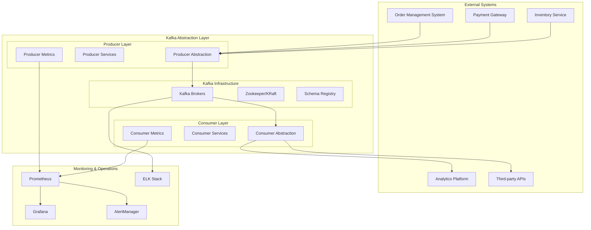
```mermaid
graph TB
    subgraph "External Systems"
        ES1[Order Management System]
        ES2[Payment Gateway]
        ES3[Inventory Service]
        ES4[Analytics Platform]
        ES5[Third-party APIs]
    end
    
    subgraph "Kafka Abstraction Layer"
        subgraph "Producer Layer"
            PA[Producer Abstraction]
            PS[Producer Services]
            PM[Producer Metrics]
        end
        
        subgraph "Kafka Infrastructure"
            KB[Kafka Brokers]
            ZK[Zookeeper/KRaft]
            SR[Schema Registry]
        end
        
        subgraph "Consumer Layer"
            CA[Consumer Abstraction]
            CS[Consumer Services]
            CM[Consumer Metrics]
        end
    end
    
    subgraph "Monitoring & Operations"
        PROM[Prometheus]
        GRAF[Grafana]
        ELK[ELK Stack]
        ALERT[AlertManager]
    end
    
    ES1 --> PA
    ES2 --> PA
    ES3 --> PA
    
    PA --> KB
    KB --> CA
    
    CA --> ES4
    CA --> ES5
    
    PM --> PROM
    CM --> PROM
    PROM --> GRAF
    KB --> ELK
    PROM --> ALERT
```

### Architectural Principles

| Principle | Description | Implementation |
|-----------|-------------|----------------|
| **Separation of Concerns** | Business logic isolated from infrastructure | Template pattern with abstract base classes |
| **Single Responsibility** | Each component has one clear purpose | Dedicated classes for serialization, partitioning, error handling |
| **Open/Closed** | Open for extension, closed for modification | Interface-based design with pluggable implementations |
| **Dependency Inversion** | Depend on abstractions, not concretions | Dependency injection via Spring IoC |
| **Interface Segregation** | Specific interfaces over general ones | Separate interfaces for batch, transactional, async operations |
| **Don't Repeat Yourself** | Eliminate code duplication | Shared base classes and utility methods |

---

## 2. System Architecture Views

### 2.1 Layered Architecture View

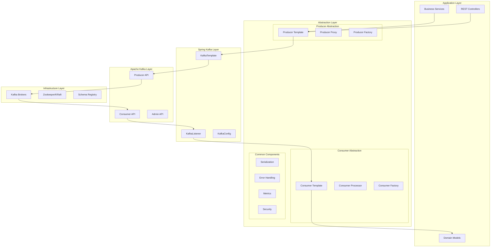
```mermaid
graph TB
    subgraph "Application Layer"
        APP1[Business Services]
        APP2[REST Controllers]
        APP3[Domain Models]
    end
    
    subgraph "Abstraction Layer"
        subgraph "Producer Abstraction"
            PT[Producer Template]
            PP[Producer Proxy]
            PF[Producer Factory]
        end
        
        subgraph "Consumer Abstraction"
            CT[Consumer Template]
            CP[Consumer Processor]
            CF[Consumer Factory]
        end
        
        subgraph "Common Components"
            SER[Serialization]
            ERR[Error Handling]
            MET[Metrics]
            SEC[Security]
        end
    end
    
    subgraph "Spring Kafka Layer"
        KT[KafkaTemplate]
        KL[KafkaListener]
        KC[KafkaConfig]
    end
    
    subgraph "Apache Kafka Layer"
        PRD[Producer API]
        CNS[Consumer API]
        ADM[Admin API]
    end
    
    subgraph "Infrastructure Layer"
        BRK[Kafka Brokers]
        ZOO[Zookeeper/KRaft]
        SCH[Schema Registry]
    end
    
    APP1 --> PT
    APP2 --> PT
    PT --> KT
    KT --> PRD
    PRD --> BRK
    
    BRK --> CNS
    CNS --> KL
    KL --> CT
    CT --> APP3
```

### 2.2 Component Interaction Matrix

```
┌─────────────────┬──────────┬──────────┬──────────┬──────────┬──────────┬──────────┐
│   Component     │ Producer │ Consumer │ Metrics  │ Security │ Config   │ Error    │
│                 │ Template │ Template │ Collector│ Manager  │ Manager  │ Handler  │
├─────────────────┼──────────┼──────────┼──────────┼──────────┼──────────┼──────────┤
│Producer Template│    -     │    ✗     │    ✓     │    ✓     │    ✓     │    ✓     │
│Consumer Template│    ✗     │    -     │    ✓     │    ✓     │    ✓     │    ✓     │
│Metrics Collector│    ✓     │    ✓     │    -     │    ✗     │    ✓     │    ✗     │
│Security Manager │    ✓     │    ✓     │    ✗     │    -     │    ✓     │    ✗     │
│Config Manager   │    ✓     │    ✓     │    ✓     │    ✓     │    -     │    ✗     │
│Error Handler    │    ✓     │    ✓     │    ✓     │    ✗     │    ✓     │    -     │
└─────────────────┴──────────┴──────────┴──────────┴──────────┴──────────┴──────────┘

Legend: ✓ = Direct dependency, ✗ = No dependency, - = Self
```

---

## 3. Component Architecture

### 3.1 Producer Component Architecture

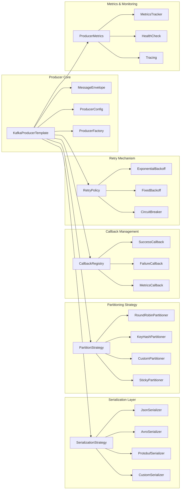
```mermaid
graph LR
    subgraph "Producer Core"
        KPT[KafkaProducerTemplate<K,V>]
        ME[MessageEnvelope<K,V>]
        PC[ProducerConfig]
        PF[ProducerFactory]
    end
    
    subgraph "Serialization Layer"
        SS[SerializationStrategy]
        JS[JsonSerializer]
        AS[AvroSerializer]
        PS[ProtobufSerializer]
        CS[CustomSerializer]
    end
    
    subgraph "Partitioning Strategy"
        PST[PartitionStrategy]
        RR[RoundRobinPartitioner]
        KH[KeyHashPartitioner]
        CP[CustomPartitioner]
        ST[StickyPartitioner]
    end
    
    subgraph "Callback Management"
        CB[CallbackRegistry]
        SC[SuccessCallback]
        FC[FailureCallback]
        MC[MetricsCallback]
    end
    
    subgraph "Retry Mechanism"
        RP[RetryPolicy]
        EB[ExponentialBackoff]
        FB[FixedBackoff]
        CB2[CircuitBreaker]
    end
    
    subgraph "Metrics & Monitoring"
        PM[ProducerMetrics]
        MT[MetricsTracker]
        HC[HealthCheck]
        TR[Tracing]
    end
    
    KPT --> ME
    KPT --> PC
    KPT --> PF
    KPT --> SS
    KPT --> PST
    KPT --> CB
    KPT --> RP
    KPT --> PM
    
    SS --> JS
    SS --> AS
    SS --> PS
    SS --> CS
    
    PST --> RR
    PST --> KH
    PST --> CP
    PST --> ST
    
    CB --> SC
    CB --> FC
    CB --> MC
    
    RP --> EB
    RP --> FB
    RP --> CB2
    
    PM --> MT
    PM --> HC
    PM --> TR
```

### 3.2 Consumer Component Architecture

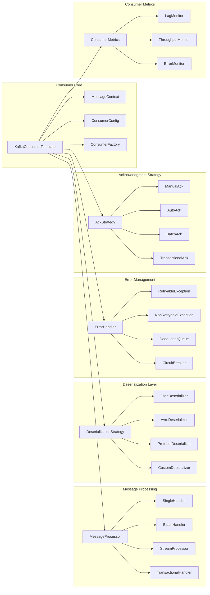
```mermaid
graph LR
    subgraph "Consumer Core"
        KCT[KafkaConsumerTemplate<K,V>]
        MC[MessageContext<K,V>]
        CC[ConsumerConfig]
        CF[ConsumerFactory]
    end
    
    subgraph "Message Processing"
        MP[MessageProcessor]
        SH[SingleHandler]
        BH[BatchHandler]
        STP[StreamProcessor]
        TH[TransactionalHandler]
    end
    
    subgraph "Deserialization Layer"
        DS[DeserializationStrategy]
        JD[JsonDeserializer]
        AD[AvroDeserializer]
        PD[ProtobufDeserializer]
        CD[CustomDeserializer]
    end
    
    subgraph "Error Management"
        EH[ErrorHandler]
        RE[RetryableException]
        NRE[NonRetryableException]
        DLQ[DeadLetterQueue]
        CB3[CircuitBreaker]
    end
    
    subgraph "Acknowledgment Strategy"
        AS2[AckStrategy]
        MA[ManualAck]
        AA[AutoAck]
        BA[BatchAck]
        TA[TransactionalAck]
    end
    
    subgraph "Consumer Metrics"
        CM2[ConsumerMetrics]
        LM[LagMonitor]
        TM[ThroughputMonitor]
        EM[ErrorMonitor]
    end
    
    KCT --> MC
    KCT --> CC
    KCT --> CF
    KCT --> MP
    KCT --> DS
    KCT --> EH
    KCT --> AS2
    KCT --> CM2
    
    MP --> SH
    MP --> BH
    MP --> STP
    MP --> TH
    
    DS --> JD
    DS --> AD
    DS --> PD
    DS --> CD
    
    EH --> RE
    EH --> NRE
    EH --> DLQ
    EH --> CB3
    
    AS2 --> MA
    AS2 --> AA
    AS2 --> BA
    AS2 --> TA
    
    CM2 --> LM
    CM2 --> TM
    CM2 --> EM
```

---

## 4. Data Flow Architecture

### 4.1 Producer Data Flow

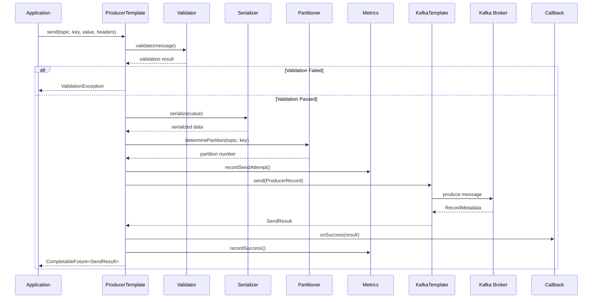
```mermaid
sequenceDiagram
    participant App as Application
    participant PT as ProducerTemplate
    participant Val as Validator
    participant Ser as Serializer
    participant Part as Partitioner
    participant Met as Metrics
    participant KT as KafkaTemplate
    participant KB as Kafka Broker
    participant CB as Callback
    
    App->>PT: send(topic, key, value, headers)
    PT->>Val: validate(message)
    Val-->>PT: validation result
    
    alt Validation Failed
        PT-->>App: ValidationException
    else Validation Passed
        PT->>Ser: serialize(value)
        Ser-->>PT: serialized data
        PT->>Part: determinePartition(topic, key)
        Part-->>PT: partition number
        PT->>Met: recordSendAttempt()
        PT->>KT: send(ProducerRecord)
        KT->>KB: produce message
        KB-->>KT: RecordMetadata
        KT-->>PT: SendResult
        PT->>CB: onSuccess(result)
        PT->>Met: recordSuccess()
        PT-->>App: CompletableFuture<SendResult>
    end
```

### 4.2 Consumer Data Flow

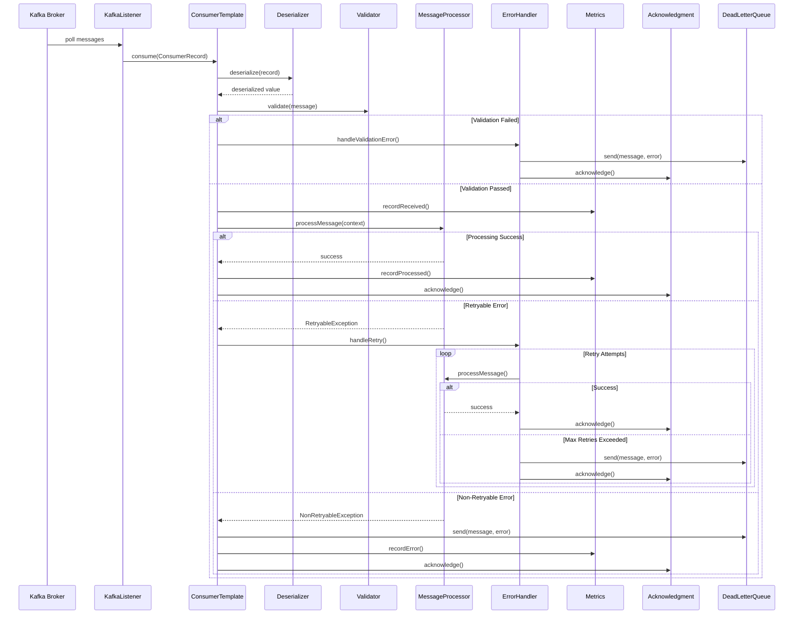
```mermaid
sequenceDiagram
    participant KB as Kafka Broker
    participant KL as KafkaListener
    participant CT as ConsumerTemplate
    participant Des as Deserializer
    participant Val as Validator
    participant Proc as MessageProcessor
    participant EH as ErrorHandler
    participant Met as Metrics
    participant Ack as Acknowledgment
    participant DLQ as DeadLetterQueue
    
    KB->>KL: poll messages
    KL->>CT: consume(ConsumerRecord)
    CT->>Des: deserialize(record)
    Des-->>CT: deserialized value
    CT->>Val: validate(message)
    
    alt Validation Failed
        CT->>EH: handleValidationError()
        EH->>DLQ: send(message, error)
        EH->>Ack: acknowledge()
    else Validation Passed
        CT->>Met: recordReceived()
        CT->>Proc: processMessage(context)
        
        alt Processing Success
            Proc-->>CT: success
            CT->>Met: recordProcessed()
            CT->>Ack: acknowledge()
        else Retryable Error
            Proc-->>CT: RetryableException
            CT->>EH: handleRetry()
            loop Retry Attempts
                EH->>Proc: processMessage()
                alt Success
                    Proc-->>EH: success
                    EH->>Ack: acknowledge()
                else Max Retries Exceeded
                    EH->>DLQ: send(message, error)
                    EH->>Ack: acknowledge()
                end
            end
        else Non-Retryable Error
            Proc-->>CT: NonRetryableException
            CT->>DLQ: send(message, error)
            CT->>Met: recordError()
            CT->>Ack: acknowledge()
        end
    end
```

---

## 5. Sequence Diagrams

### 5.1 Transactional Producer Flow

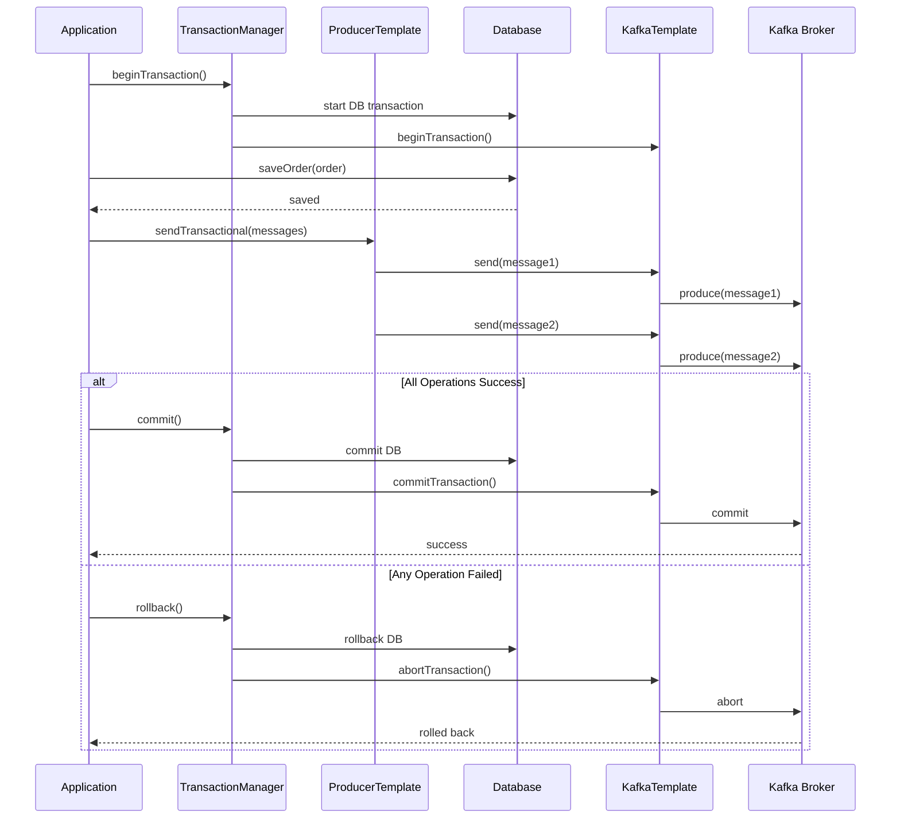
```mermaid
sequenceDiagram
    participant App as Application
    participant TM as TransactionManager
    participant PT as ProducerTemplate
    participant DB as Database
    participant KT as KafkaTemplate
    participant KB as Kafka Broker
    
    App->>TM: beginTransaction()
    TM->>DB: start DB transaction
    TM->>KT: beginTransaction()
    
    App->>DB: saveOrder(order)
    DB-->>App: saved
    
    App->>PT: sendTransactional(messages)
    PT->>KT: send(message1)
    KT->>KB: produce(message1)
    PT->>KT: send(message2)
    KT->>KB: produce(message2)
    
    alt All Operations Success
        App->>TM: commit()
        TM->>DB: commit DB
        TM->>KT: commitTransaction()
        KT->>KB: commit
        KB-->>App: success
    else Any Operation Failed
        App->>TM: rollback()
        TM->>DB: rollback DB
        TM->>KT: abortTransaction()
        KT->>KB: abort
        KB-->>App: rolled back
    end
```

### 5.2 Batch Consumer Processing

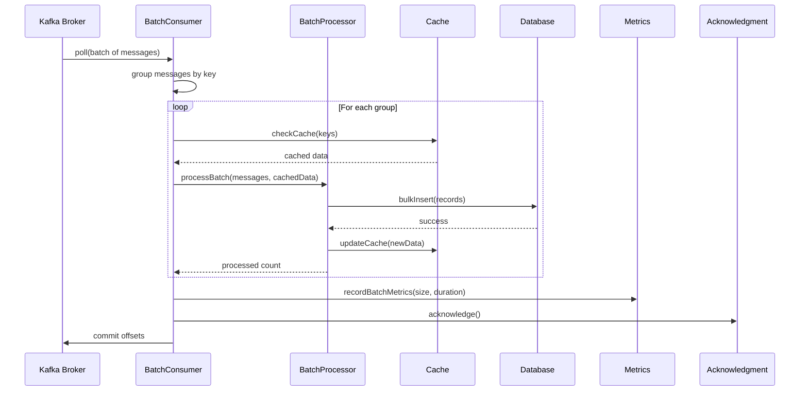
```mermaid
sequenceDiagram
    participant KB as Kafka Broker
    participant BC as BatchConsumer
    participant BP as BatchProcessor
    participant Cache as Cache
    participant DB as Database
    participant Met as Metrics
    participant Ack as Acknowledgment
    
    KB->>BC: poll(batch of messages)
    BC->>BC: group messages by key
    
    loop For each group
        BC->>Cache: checkCache(keys)
        Cache-->>BC: cached data
        BC->>BP: processBatch(messages, cachedData)
        BP->>DB: bulkInsert(records)
        DB-->>BP: success
        BP->>Cache: updateCache(newData)
        BP-->>BC: processed count
    end
    
    BC->>Met: recordBatchMetrics(size, duration)
    BC->>Ack: acknowledge()
    BC->>KB: commit offsets
```

---

## 6. Class Architecture

### 6.1 Core Class Hierarchy

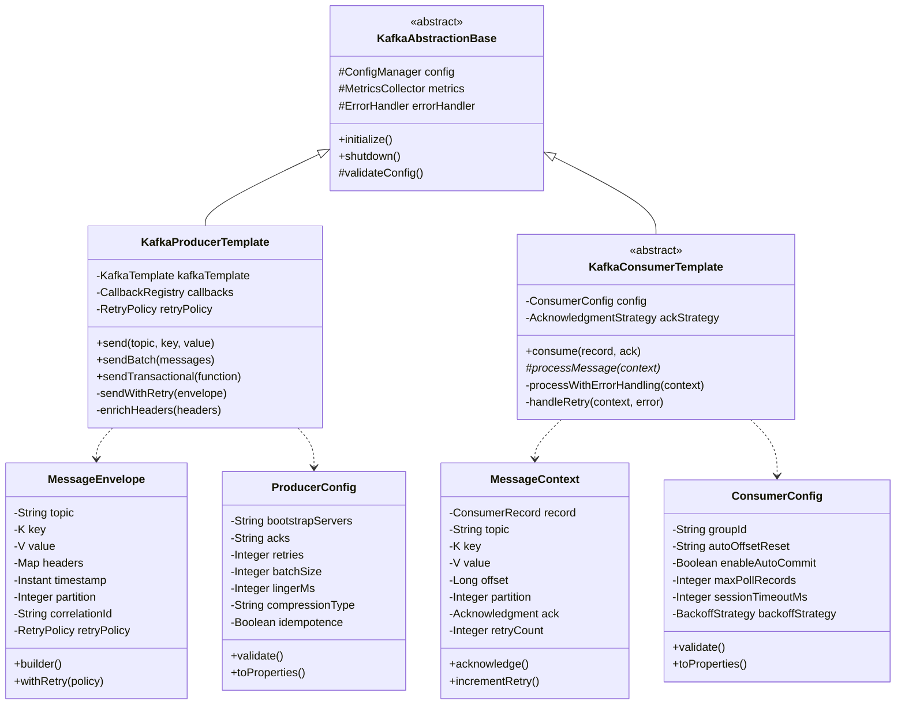
```mermaid
classDiagram
    class KafkaAbstractionBase {
        <<abstract>>
        #ConfigManager config
        #MetricsCollector metrics
        #ErrorHandler errorHandler
        +initialize()
        +shutdown()
        #validateConfig()
    }
    
    class KafkaProducerTemplate {
        -KafkaTemplate kafkaTemplate
        -CallbackRegistry callbacks
        -RetryPolicy retryPolicy
        +send(topic, key, value)
        +sendBatch(messages)
        +sendTransactional(function)
        -sendWithRetry(envelope)
        -enrichHeaders(headers)
    }
    
    class KafkaConsumerTemplate {
        <<abstract>>
        -ConsumerConfig config
        -AcknowledgmentStrategy ackStrategy
        +consume(record, ack)
        #processMessage(context)*
        -processWithErrorHandling(context)
        -handleRetry(context, error)
    }
    
    class MessageEnvelope {
        -String topic
        -K key
        -V value
        -Map headers
        -Instant timestamp
        -Integer partition
        -String correlationId
        -RetryPolicy retryPolicy
        +builder()
        +withRetry(policy)
    }
    
    class MessageContext {
        -ConsumerRecord record
        -String topic
        -K key
        -V value
        -Long offset
        -Integer partition
        -Acknowledgment ack
        -Integer retryCount
        +acknowledge()
        +incrementRetry()
    }
    
    class ProducerConfig {
        -String bootstrapServers
        -String acks
        -Integer retries
        -Integer batchSize
        -Integer lingerMs
        -String compressionType
        -Boolean idempotence
        +validate()
        +toProperties()
    }
    
    class ConsumerConfig {
        -String groupId
        -String autoOffsetReset
        -Boolean enableAutoCommit
        -Integer maxPollRecords
        -Integer sessionTimeoutMs
        -BackoffStrategy backoffStrategy
        +validate()
        +toProperties()
    }
    
    KafkaAbstractionBase <|-- KafkaProducerTemplate
    KafkaAbstractionBase <|-- KafkaConsumerTemplate
    KafkaProducerTemplate ..> MessageEnvelope
    KafkaConsumerTemplate ..> MessageContext
    KafkaProducerTemplate ..> ProducerConfig
    KafkaConsumerTemplate ..> ConsumerConfig
```

### 6.2 Error Handling Class Structure

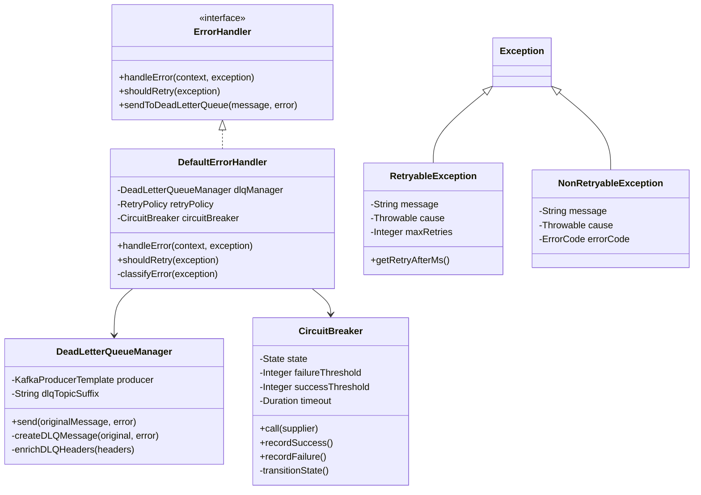
```mermaid
classDiagram
    class ErrorHandler {
        <<interface>>
        +handleError(context, exception)
        +shouldRetry(exception)
        +sendToDeadLetterQueue(message, error)
    }
    
    class DefaultErrorHandler {
        -DeadLetterQueueManager dlqManager
        -RetryPolicy retryPolicy
        -CircuitBreaker circuitBreaker
        +handleError(context, exception)
        +shouldRetry(exception)
        -classifyError(exception)
    }
    
    class RetryableException {
        -String message
        -Throwable cause
        -Integer maxRetries
        +getRetryAfterMs()
    }
    
    class NonRetryableException {
        -String message
        -Throwable cause
        -ErrorCode errorCode
    }
    
    class DeadLetterQueueManager {
        -KafkaProducerTemplate producer
        -String dlqTopicSuffix
        +send(originalMessage, error)
        -createDLQMessage(original, error)
        -enrichDLQHeaders(headers)
    }
    
    class CircuitBreaker {
        -State state
        -Integer failureThreshold
        -Integer successThreshold
        -Duration timeout
        +call(supplier)
        +recordSuccess()
        +recordFailure()
        -transitionState()
    }
    
    ErrorHandler <|.. DefaultErrorHandler
    DefaultErrorHandler --> DeadLetterQueueManager
    DefaultErrorHandler --> CircuitBreaker
    Exception <|-- RetryableException
    Exception <|-- NonRetryableException
```

---

## 7. Deployment Architecture

### 7.1 Container Deployment Architecture

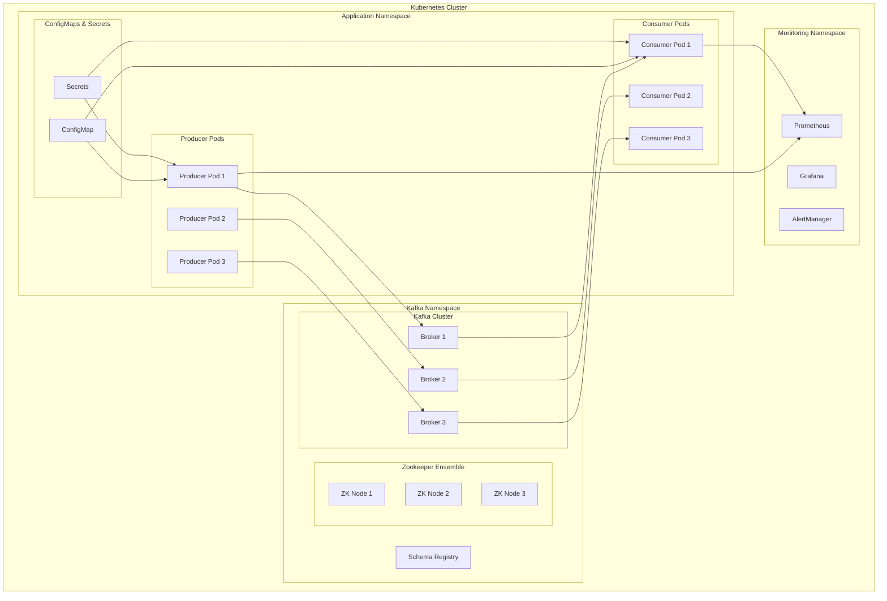
```mermaid
graph TB
    subgraph "Kubernetes Cluster"
        subgraph "Application Namespace"
            subgraph "Producer Pods"
                PP1[Producer Pod 1]
                PP2[Producer Pod 2]
                PP3[Producer Pod 3]
            end
            
            subgraph "Consumer Pods"
                CP1[Consumer Pod 1]
                CP2[Consumer Pod 2]
                CP3[Consumer Pod 3]
            end
            
            subgraph "ConfigMaps & Secrets"
                CM[ConfigMap]
                SEC[Secrets]
            end
        end
        
        subgraph "Kafka Namespace"
            subgraph "Kafka Cluster"
                B1[Broker 1]
                B2[Broker 2]
                B3[Broker 3]
            end
            
            subgraph "Zookeeper Ensemble"
                ZK1[ZK Node 1]
                ZK2[ZK Node 2]
                ZK3[ZK Node 3]
            end
            
            SR[Schema Registry]
        end
        
        subgraph "Monitoring Namespace"
            PROM[Prometheus]
            GRAF[Grafana]
            AM[AlertManager]
        end
    end
    
    PP1 --> B1
    PP2 --> B2
    PP3 --> B3
    
    B1 --> CP1
    B2 --> CP2
    B3 --> CP3
    
    CM --> PP1
    CM --> CP1
    SEC --> PP1
    SEC --> CP1
    
    PP1 --> PROM
    CP1 --> PROM
```

### 7.2 Multi-Region Deployment

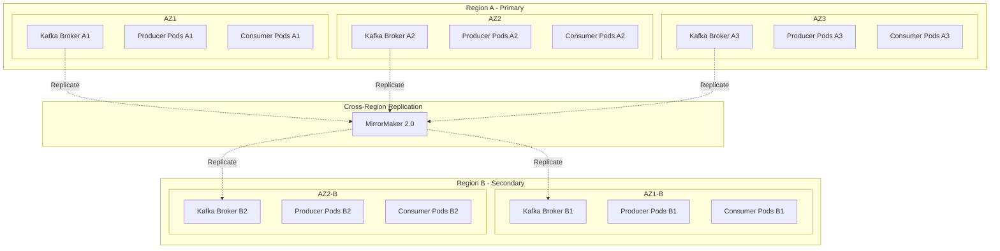
```mermaid
graph TB
    subgraph "Region A - Primary"
        subgraph "AZ1"
            KBA1[Kafka Broker A1]
            PPA1[Producer Pods A1]
            CPA1[Consumer Pods A1]
        end
        
        subgraph "AZ2"
            KBA2[Kafka Broker A2]
            PPA2[Producer Pods A2]
            CPA2[Consumer Pods A2]
        end
        
        subgraph "AZ3"
            KBA3[Kafka Broker A3]
            PPA3[Producer Pods A3]
            CPA3[Consumer Pods A3]
        end
    end
    
    subgraph "Region B - Secondary"
        subgraph "AZ1-B"
            KBB1[Kafka Broker B1]
            PPB1[Producer Pods B1]
            CPB1[Consumer Pods B1]
        end
        
        subgraph "AZ2-B"
            KBB2[Kafka Broker B2]
            PPB2[Producer Pods B2]
            CPB2[Consumer Pods B2]
        end
    end
    
    subgraph "Cross-Region Replication"
        MM[MirrorMaker 2.0]
    end
    
    KBA1 -.->|Replicate| MM
    KBA2 -.->|Replicate| MM
    KBA3 -.->|Replicate| MM
    MM -.->|Replicate| KBB1
    MM -.->|Replicate| KBB2
```

---

## 8. Integration Patterns

### 8.1 Event Sourcing Pattern

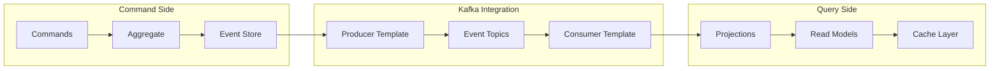
```mermaid
graph LR
    subgraph "Command Side"
        CMD[Commands]
        AGG[Aggregate]
        ES[Event Store]
    end
    
    subgraph "Kafka Integration"
        PRD[Producer Template]
        TOP[Event Topics]
        CON[Consumer Template]
    end
    
    subgraph "Query Side"
        PROJ[Projections]
        READ[Read Models]
        CACHE[Cache Layer]
    end
    
    CMD --> AGG
    AGG --> ES
    ES --> PRD
    PRD --> TOP
    TOP --> CON
    CON --> PROJ
    PROJ --> READ
    READ --> CACHE
```

### 8.2 Saga Pattern Implementation

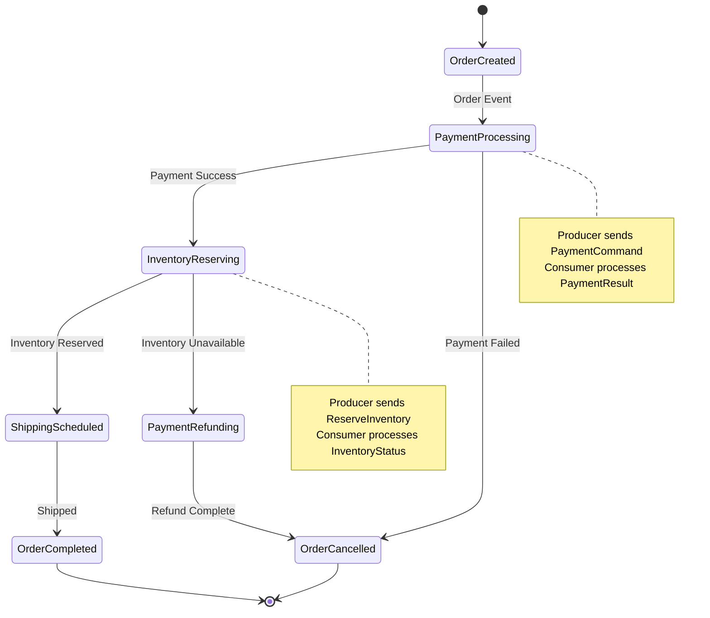
```mermaid
stateDiagram-v2
    [*] --> OrderCreated
    OrderCreated --> PaymentProcessing: Order Event
    PaymentProcessing --> InventoryReserving: Payment Success
    PaymentProcessing --> OrderCancelled: Payment Failed
    InventoryReserving --> ShippingScheduled: Inventory Reserved
    InventoryReserving --> PaymentRefunding: Inventory Unavailable
    PaymentRefunding --> OrderCancelled: Refund Complete
    ShippingScheduled --> OrderCompleted: Shipped
    OrderCancelled --> [*]
    OrderCompleted --> [*]
    
    note right of PaymentProcessing
        Producer sends PaymentCommand
        Consumer processes PaymentResult
    end note
    
    note right of InventoryReserving
        Producer sends ReserveInventory
        Consumer processes InventoryStatus
    end note
```

### 8.3 CQRS Integration Pattern

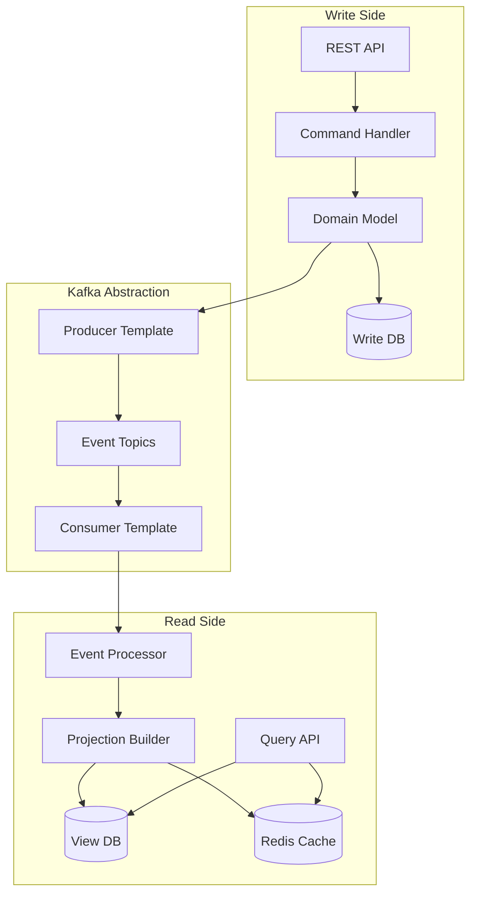
```mermaid
graph TB
    subgraph "Write Side"
        API[REST API]
        CMD[Command Handler]
        DOM[Domain Model]
        DB[(Write DB)]
    end
    
    subgraph "Kafka Abstraction"
        PROD[Producer Template]
        EVT[Event Topics]
        CONS[Consumer Template]
    end
    
    subgraph "Read Side"
        PROC[Event Processor]
        PROJ[Projection Builder]
        VIEW[(View DB)]
        CACHE[(Redis Cache)]
        QUERY[Query API]
    end
    
    API --> CMD
    CMD --> DOM
    DOM --> DB
    DOM --> PROD
    PROD --> EVT
    EVT --> CONS
    CONS --> PROC
    PROC --> PROJ
    PROJ --> VIEW
    PROJ --> CACHE
    QUERY --> VIEW
    QUERY --> CACHE
```

---

## 9. Implementation Decision Matrix

### 9.1 Technology Selection Matrix

| Component | Option 1 | Option 2 | Option 3 | Selected | Rationale |
|-----------|----------|----------|----------|----------|-----------|
| **Serialization** | JSON | Avro | Protobuf | **Avro** | Schema evolution, compact format, schema registry integration |
| **Partitioning** | Round Robin | Key Hash | Custom | **Key Hash** | Ensures message ordering per key, predictable distribution |
| **Error Handling** | Retry Only | DLQ Only | Retry + DLQ | **Retry + DLQ** | Comprehensive error recovery with fallback |
| **Acknowledgment** | Auto | Manual | Manual Immediate | **Manual** | Precise control over offset commits |
| **Batch Processing** | Fixed Size | Time-based | Dynamic | **Dynamic** | Adapts to load, optimizes throughput |
| **Compression** | None | Snappy | LZ4 | **Snappy** | Good balance of speed and compression ratio |
| **Security** | PLAINTEXT | SSL | SASL_SSL | **SASL_SSL** | Authentication + encryption |
| **Monitoring** | JMX | Prometheus | Custom | **Prometheus** | Cloud-native, extensive ecosystem |

### 9.2 Configuration Decision Tree

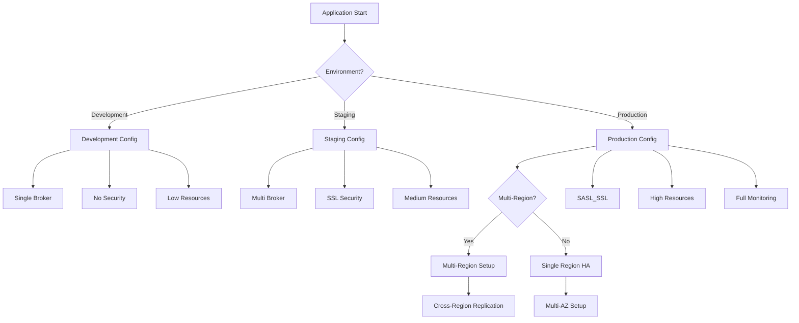
```mermaid
graph TD
    Start[Application Start]
    Start --> CheckEnv{Environment?}
    
    CheckEnv -->|Development| DevConfig[Development Config]
    CheckEnv -->|Staging| StageConfig[Staging Config]
    CheckEnv -->|Production| ProdConfig[Production Config]
    
    DevConfig --> SingleBroker[Single Broker]
    DevConfig --> NoSecurity[No Security]
    DevConfig --> LowResources[Low Resources]
    
    StageConfig --> MultiBroker[Multi Broker]
    StageConfig --> BasicSecurity[SSL Security]
    StageConfig --> MedResources[Medium Resources]
    
    ProdConfig --> CheckRegion{Multi-Region?}
    CheckRegion -->|Yes| MultiRegion[Multi-Region Setup]
    CheckRegion -->|No| SingleRegion[Single Region HA]
    
    MultiRegion --> CrossReplication[Cross-Region Replication]
    SingleRegion --> MultiAZ[Multi-AZ Setup]
    
    ProdConfig --> FullSecurity[SASL_SSL]
    ProdConfig --> HighResources[High Resources]
    ProdConfig --> Monitoring[Full Monitoring]
```

### 9.3 Performance Tuning Matrix

| Parameter | Low Latency | High Throughput | Balanced | Description |
|-----------|-------------|-----------------|----------|-------------|
| **batch.size** | 1 | 65536 | 16384 | Messages per batch |
| **linger.ms** | 0 | 100 | 10 | Wait time for batching |
| **compression.type** | none | lz4 | snappy | Compression algorithm |
| **acks** | 1 | all | all | Durability level |
| **max.in.flight.requests** | 1 | 10 | 5 | Parallel requests |
| **buffer.memory** | 33554432 | 134217728 | 67108864 | Producer buffer size |
| **fetch.min.bytes** | 1 | 50000 | 1024 | Consumer min fetch |
| **fetch.max.wait.ms** | 0 | 500 | 100 | Consumer max wait |

---

## 10. Performance Architecture

### 10.1 Performance Optimization Layers

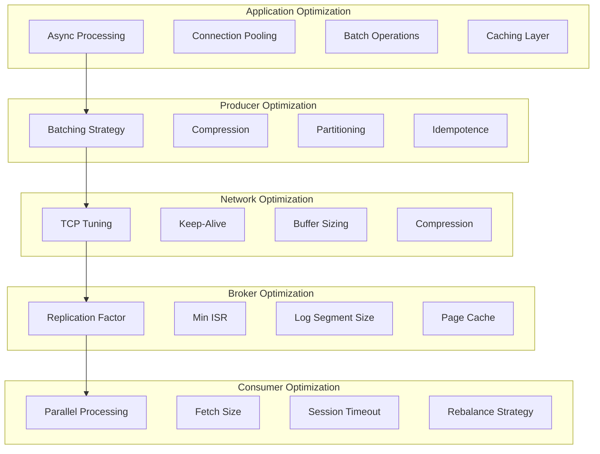
```mermaid
graph TB
    subgraph "Application Optimization"
        AO1[Async Processing]
        AO2[Connection Pooling]
        AO3[Batch Operations]
        AO4[Caching Layer]
    end
    
    subgraph "Producer Optimization"
        PO1[Batching Strategy]
        PO2[Compression]
        PO3[Partitioning]
        PO4[Idempotence]
    end
    
    subgraph "Network Optimization"
        NO1[TCP Tuning]
        NO2[Keep-Alive]
        NO3[Buffer Sizing]
        NO4[Compression]
    end
    
    subgraph "Broker Optimization"
        BO1[Replication Factor]
        BO2[Min ISR]
        BO3[Log Segment Size]
        BO4[Page Cache]
    end
    
    subgraph "Consumer Optimization"
        CO1[Parallel Processing]
        CO2[Fetch Size]
        CO3[Session Timeout]
        CO4[Rebalance Strategy]
    end
    
    AO1 --> PO1
    PO1 --> NO1
    NO1 --> BO1
    BO1 --> CO1
```

### 10.2 Throughput vs Latency Trade-offs

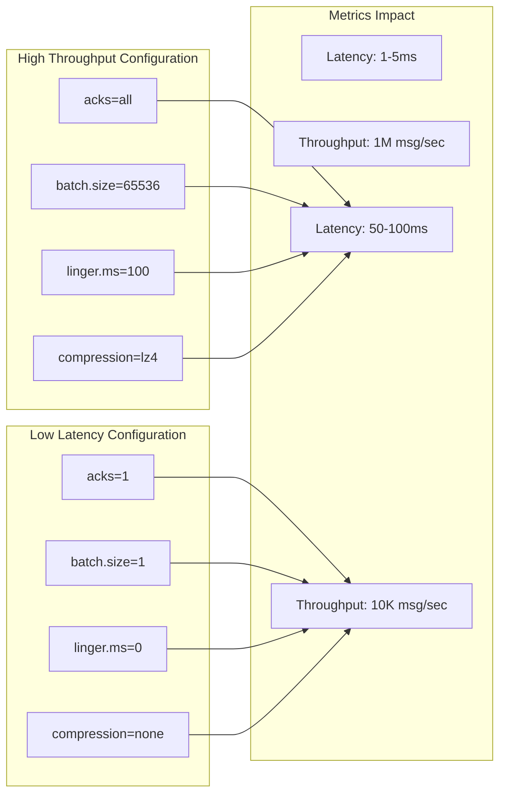
```mermaid
graph LR
    subgraph "Low Latency Configuration"
        LL1[acks=1]
        LL2[batch.size=1]
        LL3[linger.ms=0]
        LL4[compression=none]
    end
    
    subgraph "High Throughput Configuration"
        HT1[acks=all]
        HT2[batch.size=65536]
        HT3[linger.ms=100]
        HT4[compression=lz4]
    end
    
    subgraph "Metrics Impact"
        LAT[Latency: 1-5ms]
        THR[Throughput: 1M msg/sec]
        LAT2[Latency: 50-100ms]
        THR2[Throughput: 10K msg/sec]
    end
    
    LL1 --> THR2
    LL2 --> THR2
    LL3 --> THR2
    LL4 --> THR2
    
    HT1 --> LAT2
    HT2 --> LAT2
    HT3 --> LAT2
    HT4 --> LAT2
```

---

## 11. Security Architecture

### 11.1 Security Layers

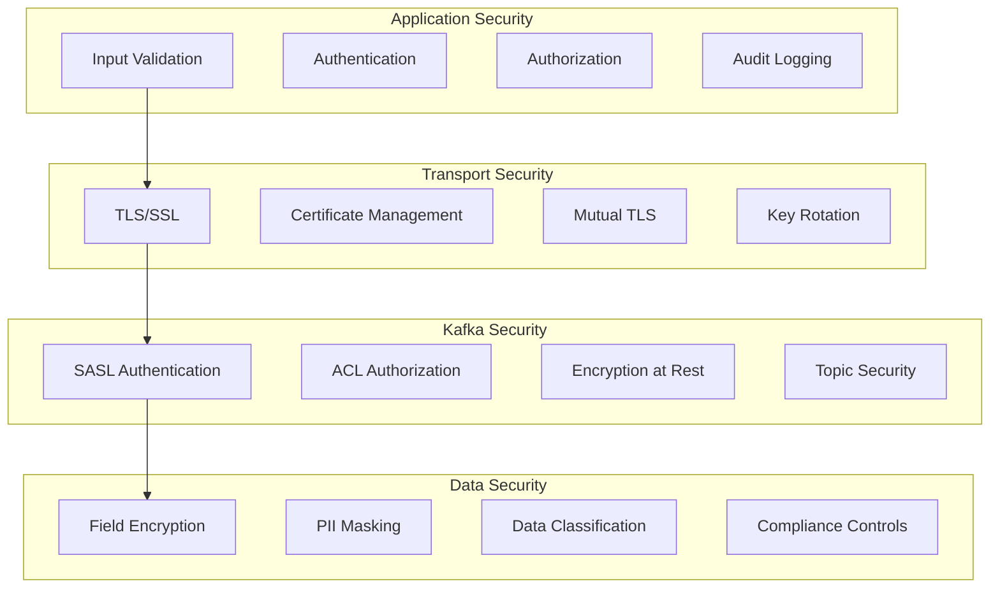
```mermaid
graph TB
    subgraph "Application Security"
        AS1[Input Validation]
        AS2[Authentication]
        AS3[Authorization]
        AS4[Audit Logging]
    end
    
    subgraph "Transport Security"
        TS1[TLS/SSL]
        TS2[Certificate Management]
        TS3[Mutual TLS]
        TS4[Key Rotation]
    end
    
    subgraph "Kafka Security"
        KS1[SASL Authentication]
        KS2[ACL Authorization]
        KS3[Encryption at Rest]
        KS4[Topic Security]
    end
    
    subgraph "Data Security"
        DS1[Field Encryption]
        DS2[PII Masking]
        DS3[Data Classification]
        DS4[Compliance Controls]
    end
    
    AS1 --> TS1
    TS1 --> KS1
    KS1 --> DS1
```

### 11.2 Authentication & Authorization Flow

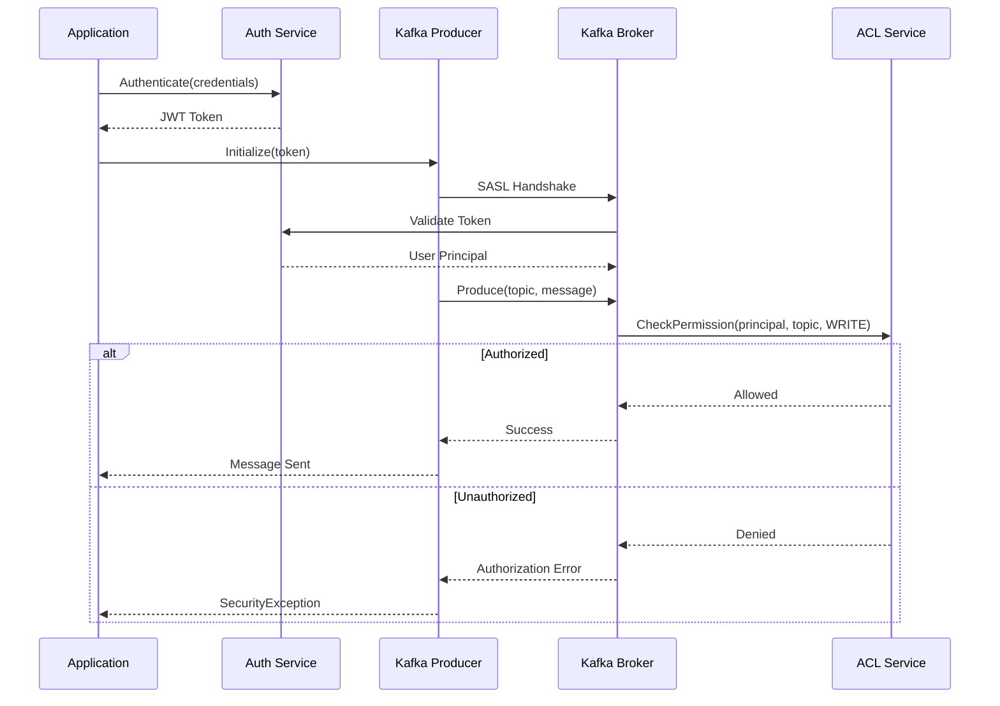
```mermaid
sequenceDiagram
    participant App as Application
    participant Auth as Auth Service
    participant KP as Kafka Producer
    participant KB as Kafka Broker
    participant ACL as ACL Service
    
    App->>Auth: Authenticate(credentials)
    Auth-->>App: JWT Token
    
    App->>KP: Initialize(token)
    KP->>KB: SASL Handshake
    KB->>Auth: Validate Token
    Auth-->>KB: User Principal
    
    KP->>KB: Produce(topic, message)
    KB->>ACL: CheckPermission(principal, topic, WRITE)
    
    alt Authorized
        ACL-->>KB: Allowed
        KB-->>KP: Success
        KP-->>App: Message Sent
    else Unauthorized
        ACL-->>KB: Denied
        KB-->>KP: Authorization Error
        KP-->>App: SecurityException
    end
```

---

## 12. Monitoring Architecture

### 12.1 Metrics Collection Pipeline

```mermaid
graph LR
    subgraph "Application Metrics"
        AM1[Producer Metrics]
        AM2[Consumer Metrics]
        AM3[Business Metrics]
        AM4[Error Metrics]
    end
    
    subgraph "JMX Exporters"
        JMX1[Kafka JMX]
        JMX2[JVM Metrics]
        JMX3[Custom MBeans]
    end
    
    subgraph "Prometheus Stack"
        PE[Prometheus Exporter]
        PS[Prometheus Server]
        AM5[AlertManager]
    end
    
    subgraph "Visualization"
        GD[Grafana Dashboards]
        AD[Alert Dashboard]
        RD[Report Generator]
    end
    
    AM1 --> PE
    AM2 --> PE
    AM3 --> PE
    AM4 --> PE
    
    JMX1 --> PE
    JMX2 --> PE
    JMX3 --> PE
    
    PE --> PS
    PS --> AM5
    PS --> GD
    AM5 --> AD
    GD --> RD
```

### 12.2 Key Metrics & Thresholds

| Metric Category | Metric Name | Warning Threshold | Critical Threshold | Action |
|-----------------|-------------|-------------------|-------------------|---------|
| **Producer** | Send Rate | < 100 msg/s | < 10 msg/s | Scale producers |
| **Producer** | Error Rate | > 1% | > 5% | Check broker health |
| **Producer** | Batch Size | < 100 | < 10 | Tune batching config |
| **Consumer** | Lag | > 1000 | > 10000 | Scale consumers |
| **Consumer** | Processing Time | > 100ms | > 1000ms | Optimize processing |
| **Consumer** | Rebalance Rate | > 1/hour | > 5/hour | Check consumer health |
| **Broker** | ISR Shrink Rate | > 0 | > 1/min | Check replication |
| **Broker** | Disk Usage | > 70% | > 90% | Add storage/cleanup |
| **Network** | Request Latency | > 50ms | > 200ms | Check network |

### 12.3 Observability Dashboard Layout

```
┌─────────────────────────────────────────────────────────────────┐
│                    Kafka Abstraction Layer Dashboard            │
├──────────────────────┬──────────────────────┬──────────────────┤
│   Producer Metrics   │   Consumer Metrics   │   System Health  │
├──────────────────────┼──────────────────────┼──────────────────┤
│ • Messages/sec: 50K  │ • Messages/sec: 48K  │ • Brokers: 3/3 ✓ │
│ • Error Rate: 0.01%  │ • Lag: 245 msgs      │ • Zookeeper: ✓   │
│ • Avg Latency: 12ms  │ • Partitions: 30     │ • Schema Reg: ✓  │
│ • Batch Size: 245    │ • Consumer Groups: 5 │ • Disk: 45%      │
├──────────────────────┴──────────────────────┴──────────────────┤
│                         Latency Histogram                       │
│  [===========================█████===]  P50: 10ms              │
│  [=================================███]  P95: 45ms              │
│  [=====================================█] P99: 120ms           │
├──────────────────────────────────────────────────────────────────┤
│                     Topic Throughput (24h)                      │
│  100K ┤     ╭─╮    ╭╮                                        │
│   75K ┤  ╭─╯  ╰─╮╭─╯╰─╮                                     │
│   50K ┤ ╭╯      ╰╯    ╰─╮  ╭─────╮                         │
│   25K ┤╭╯               ╰──╯      ╰─╮                       │
│     0 └┴──────────────────────────────┴─────────────────────┘ │
│       00:00   06:00   12:00   18:00   24:00                    │
├──────────────────────────────────────────────────────────────────┤
│                        Recent Alerts                            │
│ ⚠ [12:34] Consumer lag exceeded 5000 for group 'analytics'     │
│ ✓ [12:45] Consumer lag recovered for group 'analytics'         │
│ ⚠ [13:15] Producer error rate spike to 2.3%                    │
└──────────────────────────────────────────────────────────────────┘
```

---

## Implementation Roadmap

### Phase 1: Foundation (Weeks 1-2)
1. Set up project structure and dependencies
2. Implement core producer/consumer templates
3. Basic serialization (JSON)
4. Unit test framework

### Phase 2: Advanced Features (Weeks 3-4)
1. Implement retry mechanisms and DLQ
2. Add Avro/Protobuf support
3. Batch processing capabilities
4. Transactional support

### Phase 3: Observability (Weeks 5-6)
1. Integrate metrics collection
2. Set up Prometheus/Grafana
3. Implement health checks
4. Create monitoring dashboards

### Phase 4: Security & Performance (Weeks 7-8)
1. Implement SASL/SSL security
2. Performance tuning and optimization
3. Load testing and benchmarking
4. Security audit and hardening

### Phase 5: Production Readiness (Weeks 9-10)
1. Multi-environment configuration
2. CI/CD pipeline integration
3. Documentation and training
4. Production deployment

## Critical Success Factors

### Technical Requirements
- ✅ **Latency**: P99 < 100ms for message processing
- ✅ **Throughput**: Support 100K messages/second per instance
- ✅ **Availability**: 99.95% uptime SLA
- ✅ **Data Loss**: Zero message loss with at-least-once delivery
- ✅ **Scalability**: Linear scaling with partition count

### Operational Requirements
- ✅ **Monitoring**: Full observability with < 1 minute alert latency
- ✅ **Recovery**: RTO < 15 minutes, RPO < 1 minute
- ✅ **Security**: End-to-end encryption and authentication
- ✅ **Compliance**: GDPR/PII handling capabilities
- ✅ **Documentation**: Complete API and operational documentation

## Risk Mitigation Strategies

| Risk | Impact | Probability | Mitigation |
|------|--------|-------------|------------|
| **Broker Failure** | High | Medium | Multi-broker replication, automatic failover |
| **Consumer Lag** | Medium | High | Auto-scaling, parallel processing |
| **Message Loss** | High | Low | Idempotent producers, acknowledgment strategies |
| **Security Breach** | High | Low | Encryption, authentication, audit logging |
| **Performance Degradation** | Medium | Medium | Circuit breakers, backpressure handling |

## Conclusion

This architecture provides a comprehensive, production-ready Kafka abstraction layer that:
- **Simplifies** Kafka integration while maintaining flexibility
- **Standardizes** patterns across all microservices
- **Ensures** reliability through robust error handling
- **Optimizes** performance through intelligent batching and compression
- **Secures** data through multiple security layers
- **Monitors** system health through comprehensive metrics

The modular design allows teams to adopt components incrementally while maintaining backward compatibility and supporting future enhancements.