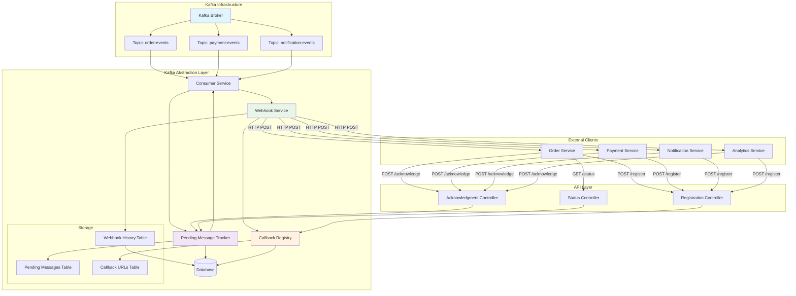

# Webhook Push Data Architecture

## Overview

This document describes the architecture for pushing Kafka messages to external clients via webhook/HTTP endpoints. The system includes callback URL storage, registration APIs, and comprehensive monitoring capabilities.

## Architecture Diagram



## Database Schema

### 1. Callback URLs Table
```sql
CREATE TABLE webhook_callbacks (
    id BIGINT PRIMARY KEY AUTO_INCREMENT,
    client_id VARCHAR(255) NOT NULL,
    client_name VARCHAR(255) NOT NULL,
    callback_url TEXT NOT NULL,
    topic_pattern VARCHAR(500) NOT NULL,
    content_type VARCHAR(100) DEFAULT 'application/json',
    auth_type ENUM('none', 'api_key', 'bearer_token', 'basic_auth', 'oauth2') DEFAULT 'none',
    auth_credentials JSON,
    timeout_seconds INTEGER DEFAULT 30,
    retry_count INTEGER DEFAULT 3,
    retry_delay_seconds INTEGER DEFAULT 5,
    status ENUM('active', 'inactive', 'suspended') DEFAULT 'active',
    failure_threshold INTEGER DEFAULT 10,
    consecutive_failures INTEGER DEFAULT 0,
    last_success_at TIMESTAMP NULL,
    last_failure_at TIMESTAMP NULL,
    created_at TIMESTAMP DEFAULT CURRENT_TIMESTAMP,
    updated_at TIMESTAMP DEFAULT CURRENT_TIMESTAMP ON UPDATE CURRENT_TIMESTAMP,
    
    INDEX idx_client_id (client_id),
    INDEX idx_topic_pattern (topic_pattern),
    INDEX idx_status (status),
    UNIQUE KEY uk_client_topic (client_id, topic_pattern)
);
```

### 2. Webhook Delivery History
```sql
CREATE TABLE webhook_delivery_history (
    id BIGINT PRIMARY KEY AUTO_INCREMENT,
    callback_id BIGINT NOT NULL,
    message_id VARCHAR(255) NOT NULL,
    topic VARCHAR(255) NOT NULL,
    partition INTEGER NOT NULL,
    offset BIGINT NOT NULL,
    attempt_number INTEGER NOT NULL,
    status ENUM('pending', 'success', 'failed', 'timeout') NOT NULL,
    http_status_code INTEGER,
    response_body TEXT,
    error_message TEXT,
    delivery_time_ms INTEGER,
    delivered_at TIMESTAMP DEFAULT CURRENT_TIMESTAMP,
    
    INDEX idx_callback_id (callback_id),
    INDEX idx_message_id (message_id),
    INDEX idx_topic_partition (topic, partition),
    INDEX idx_status (status),
    INDEX idx_delivered_at (delivered_at),
    
    FOREIGN KEY (callback_id) REFERENCES webhook_callbacks(id) ON DELETE CASCADE
);
```

### 3. Client Authentication Tokens
```sql
CREATE TABLE client_api_tokens (
    id BIGINT PRIMARY KEY AUTO_INCREMENT,
    client_id VARCHAR(255) NOT NULL,
    token_hash VARCHAR(255) NOT NULL,
    token_prefix VARCHAR(20) NOT NULL,
    scopes JSON,
    expires_at TIMESTAMP NULL,
    is_active BOOLEAN DEFAULT TRUE,
    last_used_at TIMESTAMP NULL,
    created_at TIMESTAMP DEFAULT CURRENT_TIMESTAMP,
    
    INDEX idx_client_id (client_id),
    INDEX idx_token_hash (token_hash),
    INDEX idx_expires_at (expires_at),
    UNIQUE KEY uk_token_hash (token_hash)
);
```

## API Endpoints for Webhook Registration

### WebhookRegistrationController.java
```java
@RestController
@RequestMapping("/api/v1/webhooks")
@Api(tags = "Webhook Registration", description = "Manage webhook callbacks for Kafka message delivery")
@Validated
@Slf4j
public class WebhookRegistrationController {

    @PostMapping("/register")
    @ApiOperation(value = "Register a new webhook callback", 
                  notes = "Register a webhook URL to receive Kafka messages for specified topics")
    @ApiResponses({
        @ApiResponse(code = 201, message = "Webhook registered successfully", response = WebhookResponse.class),
        @ApiResponse(code = 400, message = "Invalid request parameters"),
        @ApiResponse(code = 409, message = "Webhook already exists for this client and topic")
    })
    public ResponseEntity<WebhookResponse> registerWebhook(
            @ApiParam(value = "Webhook registration details", required = true)
            @Valid @RequestBody WebhookRegistrationRequest request) {
        
        WebhookCallback callback = webhookService.registerCallback(request);
        WebhookResponse response = WebhookResponse.from(callback);
        
        return ResponseEntity.status(HttpStatus.CREATED).body(response);
    }

    @GetMapping("/callbacks/{clientId}")
    @ApiOperation(value = "Get client's registered webhooks",
                  notes = "Retrieve all webhook callbacks for a specific client")
    public ResponseEntity<List<WebhookResponse>> getClientWebhooks(
            @ApiParam(value = "Client identifier", required = true)
            @PathVariable String clientId,
            @ApiParam(value = "Filter by status")
            @RequestParam(required = false) WebhookStatus status) {
        
        List<WebhookCallback> callbacks = webhookService.getClientCallbacks(clientId, status);
        List<WebhookResponse> responses = callbacks.stream()
            .map(WebhookResponse::from)
            .collect(Collectors.toList());
            
        return ResponseEntity.ok(responses);
    }

    @PutMapping("/callbacks/{callbackId}")
    @ApiOperation(value = "Update webhook configuration")
    public ResponseEntity<WebhookResponse> updateWebhook(
            @ApiParam(value = "Webhook callback ID", required = true)
            @PathVariable Long callbackId,
            @Valid @RequestBody WebhookUpdateRequest request) {
        
        WebhookCallback updated = webhookService.updateCallback(callbackId, request);
        return ResponseEntity.ok(WebhookResponse.from(updated));
    }

    @DeleteMapping("/callbacks/{callbackId}")
    @ApiOperation(value = "Delete webhook callback")
    public ResponseEntity<Void> deleteWebhook(
            @PathVariable Long callbackId) {
        
        webhookService.deleteCallback(callbackId);
        return ResponseEntity.noContent().build();
    }

    @PostMapping("/callbacks/{callbackId}/test")
    @ApiOperation(value = "Test webhook endpoint",
                  notes = "Send a test message to verify webhook connectivity")
    public ResponseEntity<WebhookTestResponse> testWebhook(
            @PathVariable Long callbackId,
            @RequestBody(required = false) Map<String, Object> testPayload) {
        
        WebhookTestResult result = webhookService.testCallback(callbackId, testPayload);
        return ResponseEntity.ok(WebhookTestResponse.from(result));
    }
}
```

## Data Transfer Objects (DTOs)

### WebhookRegistrationRequest
```java
@Data
@Builder
@ApiModel(description = "Webhook registration request")
public class WebhookRegistrationRequest {
    
    @ApiModelProperty(value = "Unique client identifier", required = true, example = "order-service")
    @NotBlank(message = "Client ID is required")
    private String clientId;
    
    @ApiModelProperty(value = "Human readable client name", required = true, example = "Order Processing Service")
    @NotBlank(message = "Client name is required")
    private String clientName;
    
    @ApiModelProperty(value = "Webhook callback URL", required = true, 
                     example = "https://api.example.com/webhooks/kafka-messages")
    @NotBlank(message = "Callback URL is required")
    @URL(message = "Must be a valid URL")
    private String callbackUrl;
    
    @ApiModelProperty(value = "Topic pattern to subscribe to", required = true, 
                     example = "order-events,payment-events")
    @NotBlank(message = "Topic pattern is required")
    private String topicPattern;
    
    @ApiModelProperty(value = "HTTP content type for webhook requests", 
                     example = "application/json")
    private String contentType = "application/json";
    
    @ApiModelProperty(value = "Authentication configuration")
    private WebhookAuthConfig authConfig;
    
    @ApiModelProperty(value = "Request timeout in seconds", example = "30")
    @Min(value = 5, message = "Timeout must be at least 5 seconds")
    @Max(value = 300, message = "Timeout cannot exceed 300 seconds")
    private Integer timeoutSeconds = 30;
    
    @ApiModelProperty(value = "Number of retry attempts", example = "3")
    @Min(value = 0, message = "Retry count cannot be negative")
    @Max(value = 10, message = "Retry count cannot exceed 10")
    private Integer retryCount = 3;
}
```

### WebhookAuthConfig
```java
@Data
@Builder
@ApiModel(description = "Webhook authentication configuration")
public class WebhookAuthConfig {
    
    @ApiModelProperty(value = "Authentication type", required = true,
                     allowableValues = "none,api_key,bearer_token,basic_auth,oauth2")
    @NotNull(message = "Auth type is required")
    private AuthType authType;
    
    @ApiModelProperty(value = "API key for api_key auth type")
    private String apiKey;
    
    @ApiModelProperty(value = "Bearer token for bearer_token auth type")
    private String bearerToken;
    
    @ApiModelProperty(value = "Username for basic_auth")
    private String username;
    
    @ApiModelProperty(value = "Password for basic_auth")
    private String password;
    
    @ApiModelProperty(value = "OAuth2 configuration")
    private OAuth2Config oauth2Config;
    
    public enum AuthType {
        NONE, API_KEY, BEARER_TOKEN, BASIC_AUTH, OAUTH2
    }
}
```

### WebhookResponse
```java
@Data
@Builder
@ApiModel(description = "Webhook callback response")
public class WebhookResponse {
    
    @ApiModelProperty(value = "Callback ID", example = "12345")
    private Long id;
    
    @ApiModelProperty(value = "Client identifier", example = "order-service")
    private String clientId;
    
    @ApiModelProperty(value = "Client name", example = "Order Processing Service")
    private String clientName;
    
    @ApiModelProperty(value = "Callback URL", example = "https://api.example.com/webhooks/kafka-messages")
    private String callbackUrl;
    
    @ApiModelProperty(value = "Topic pattern", example = "order-events,payment-events")
    private String topicPattern;
    
    @ApiModelProperty(value = "Webhook status", example = "ACTIVE")
    private WebhookStatus status;
    
    @ApiModelProperty(value = "Configuration details")
    private WebhookConfigResponse config;
    
    @ApiModelProperty(value = "Performance statistics")
    private WebhookStatsResponse stats;
    
    @ApiModelProperty(value = "Created timestamp")
    @JsonFormat(pattern = "yyyy-MM-dd'T'HH:mm:ss.SSS'Z'")
    private Instant createdAt;
    
    @ApiModelProperty(value = "Last updated timestamp")
    @JsonFormat(pattern = "yyyy-MM-dd'T'HH:mm:ss.SSS'Z'")
    private Instant updatedAt;
}
```

## API Endpoints Summary

| Method | Endpoint | Description |
|--------|----------|-------------|
| POST | `/api/v1/webhooks/register` | Register new webhook callback |
| GET | `/api/v1/webhooks/callbacks/{clientId}` | List client's webhooks |
| PUT | `/api/v1/webhooks/callbacks/{callbackId}` | Update webhook configuration |
| DELETE | `/api/v1/webhooks/callbacks/{callbackId}` | Delete webhook callback |
| POST | `/api/v1/webhooks/callbacks/{callbackId}/test` | Test webhook connectivity |

## Key Benefits

### Database Storage Advantages:
- **Persistence**: Webhooks survive service restarts
- **Dynamic Management**: Register/update webhooks without code changes  
- **Multi-tenancy**: Support multiple clients with different callback configurations
- **Security**: Encrypted authentication credentials storage
- **Monitoring**: Track delivery success/failure rates
- **Scalability**: Handle webhook routing efficiently

### Authentication Support:
- None (for internal/trusted services)
- API Key
- Bearer Token  
- Basic Authentication
- OAuth2

### Monitoring & Reliability:
- Delivery attempt tracking
- Success/failure statistics
- Automatic retry with exponential backoff
- Circuit breaker pattern for failing endpoints
- Dead letter queue for failed deliveries
- Health checks and alerting

## Configuration Example

```yaml
kafka:
  webhooks:
    enabled: true
    max-concurrent-deliveries: 100
    default-timeout-seconds: 30
    max-retry-attempts: 3
    circuit-breaker:
      failure-threshold: 10
      timeout-duration: PT60S
      
  database:
    cleanup-interval: PT1H
    max-history-days: 30
    
  security:
    token-expiry-days: 90
    require-https: true
```

This architecture provides a robust, scalable solution for webhook-based Kafka message delivery with comprehensive management and monitoring capabilities.